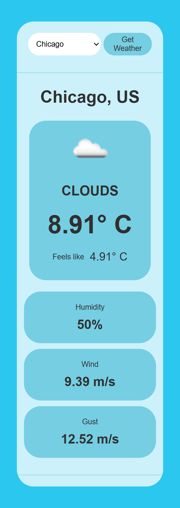
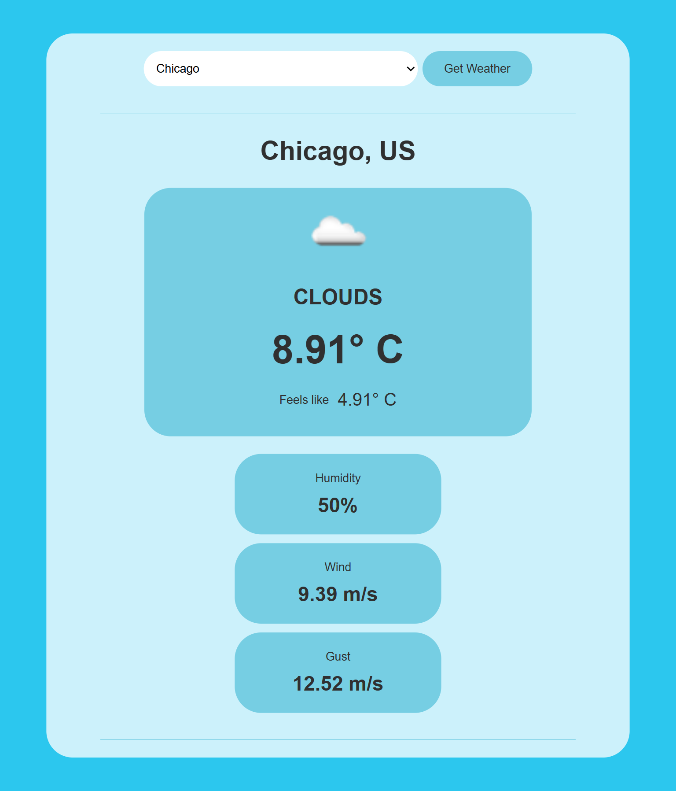
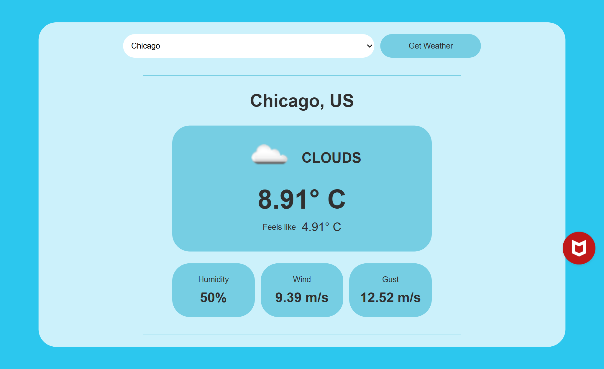

# Weather App

A responsive Weather project that allows users to view weather information for a selected city from the dropdown list.

🔗 Live Demo: https://matthew1835.github.io/weather-app/

## Features
- Weather information of selected city
- Clean and Simple UI

## Screenshots

## Tech Stack
- HTML
- CSS
- JavaScript
